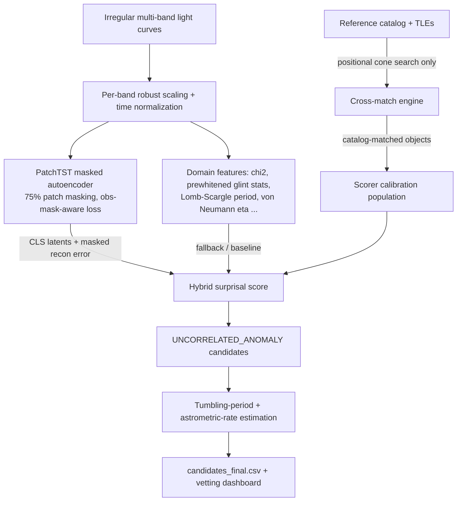

# 🛰️ Dark Satellite Hunter

**Label-free discovery of uncataloged orbital objects in optical time-domain surveys**

[](https://www.python.org/downloads/)
[](https://lightning.ai/)
[](https://streamlit.io/)
[](#-tests)

---

## 1. Problem statement

Optical time-domain surveys (ZTF, and soon LSST) photometer millions of sky
positions every night. Buried in that stream are **uncorrelated, non-cooperative
orbital objects** — tumbling rocket bodies, defunct satellites, graveyard-belt
drifters — whose optical signatures (periodic diffuse modulation punctuated by
sharp specular glints) differ from every astrophysical variable class.
There are **no labels** for these objects; the question is:

> *Can we flag them from photometry + astrometry alone, without ever training on
> "debris vs. star" labels?*

## 2. Method



1. **Self-supervised representation.** A PatchTST-style masked autoencoder
   ([src/models/patchtst_mae.py](src/models/patchtst_mae.py)) masks 75% of time
   patches and reconstructs normalized per-band magnitudes. Zero-padded epochs
   are excluded from the loss via per-patch observation weights. Anomalies
   manifest as high masked-patch reconstruction error and as Mahalanobis
   outliers in the `[CLS]` latent space (Ledoit–Wolf shrinkage covariance).
2. **Domain-feature fallback / baseline.** Without a trained checkpoint the
   pipeline uses 14 astrophysical variability statistics
   ([src/models/baselines.py](src/models/baselines.py)), including the reduced
   χ² versus a constant source and **prewhitened glint statistics** (bright
   outliers remaining after the best-fit sinusoid is subtracted — pulsating
   stars whiten away, stochastic glints survive).
3. **Ensemble scoring in checkpoint mode.** With `--ckpt_path`, the pipeline
   combines the domain-feature surprisal and the MAE surprisal as a weighted
   ensemble (`--mae_weight`, default 0.5) and reports each component's
   validation ROC-AUC separately in the summary JSON. On the small built-in
   mock survey the domain features dominate (~0.99 AUC vs ~0.4-0.6 for a
   CPU-pretrained MAE); the self-supervised pathway is designed to pay off at
   real-archive scale (>10^5 objects), and the transparent component metrics
   make its contribution measurable rather than assumed.
4. **Reference population without labels.** The scorer must be calibrated on
   "normal" objects. Instead of using ground truth, the pipeline cross-matches
   every object **by sky position** against a reference star/QSO catalog and
   calibrates on the matched population — precisely what one would do with
   Gaia on real data.
5. **Cross-match cascade** ([src/pipeline/crossmatch.py](src/pipeline/crossmatch.py)):
   reference catalog cone search → TLE/SGP4 topocentric match (Palomar
   geometry) → optional online MPC (SkyBoT) and Simbad queries. Unmatched
   objects above the surprisal threshold become `UNCORRELATED_ANOMALY`.
6. **Kinematic vetting** ([src/pipeline/orbital_fit.py](src/pipeline/orbital_fit.py)):
   least-squares astrometric rates (RA unwrap included) classify candidates
   into survey-cadence regimes (sidereal-stationary / GEO-belt drifter /
   asteroid-rate / fast mover), and a phase-coherence scan with
   baseline-adaptive frequency resolution estimates tumbling periods from
   glint timing.

## 3. Scientific-integrity design

The pipeline is engineered so that **ground-truth labels cannot leak into
discovery**:

* Simulation labels (`label`, `true_class`) are consulted only (a) by the
  simulation-side catalog builder, which plays the role of Gaia, and (b) in
  clearly marked *validation* blocks after scoring is complete.
* [tests/test_pipeline.py](tests/test_pipeline.py) contains an invariance test
  that **flips every ground-truth label and asserts the surprisal scores are
  bit-identical** (`test_no_label_leakage_in_discovery_scores`).
* Validation metrics (ROC-AUC of the label-free score against simulation
  truth, flag precision/recall) are reported separately in
  `candidates_final_summary.json` and in the dashboard's validation panel.

## 4. Quick start

```bash
git clone <your-fork-url>
cd dark-satellite-hunter
pip install -r requirements.txt
```

```bash
# 1. Unit + integrity tests (~2 min, CPU)
python -m pytest tests/ -q

# 2. Self-supervised MAE training + linear probing on the mock survey
python train.py --use_mock True --epochs 10 --batch_size 64

# 3. Baseline benchmarks (Isolation Forest, MiniRocket+Ridge, stratified split)
python evaluate_baselines.py --use_mock True

# 4. End-to-end discovery + cross-match (feature mode)
python run_discovery.py --use_mock True --top_k 100
#    ... or with the trained encoder:
python run_discovery.py --use_mock True --ckpt_path logs/patchtst_mae/version_0/checkpoints/<best>.ckpt

# 5. Interactive vetting dashboard
streamlit run app/streamlit_app.py
```

Everything runs CPU-only out of the box on the built-in physics-based mock
survey; no external downloads required.

## 5. Working with real data

### 5.1 Real telescope light curves (.parquet or .csv)

Point `--parquet` (both `train.py` and `run_discovery.py`) at a single file
**or a directory** of `.parquet`/`.csv` files:

```bash
python train.py --parquet your_data.parquet --epochs 30
python run_discovery.py --use_mock False --parquet your_data.csv --catalog_csv gaia_extract.csv
```

Required columns (aliases are auto-detected): `object_id` (`objid`,
`objectid`, `oid`, ...), `mjd` (`hjd`, `jd` — Julian Dates auto-convert to
MJD), `mag` (`magpsf`, ...), `magerr` (`sigmapsf`, ...), `filter` (`fid`,
`filtercode`, ...), plus optional `ra`, `dec` for cross-matching and the
astrometric wobble features. Non-g/r epochs (e.g. ZTF i-band) are dropped;
NaN photometry is filtered defensively.

### 5.2 Real satellite catalog (.tle / .txt from Space-Track or CelesTrak)

```bash
python run_discovery.py --use_mock False --parquet your_data.parquet --tle_path active.tle
```

Both bare 2-line and named 3-line TLE formats are parsed. Every element set
is propagated with **SGP4** to each candidate's observation epoch and matched
**topocentrically** as seen from Palomar (ZTF) — a hit tags the candidate
`KNOWN_SATELLITE` (Starlink, GPS, ...); a miss leaves it a debris candidate.
TLE matching is pure local physics and works fully offline.

### 5.3 Live internet API mode

```bash
python run_discovery.py --use_mock False --parquet your_data.parquet --offline_mode False
```

With `--offline_mode False` (requires `astroquery`), every **high-surprisal,
locally-unmatched** candidate is verified live against **Simbad** and the
**Minor Planet Center** (SkyBoT cone search at the exact epoch). Low-scoring
objects never touch the network — the online cascade is reserved for the
candidates whose classification it could actually change.

### 5.4 Reference catalog

`--catalog_csv` with columns `catalog_id, ra_deg, dec_deg[, obj_class]`
(e.g. a Gaia DR3 extract of the survey footprint) enables positional star/QSO
matching and gives the scorer its label-free calibration population.

## 6. Repository layout

```text
dark-satellite-hunter/
├── requirements.txt
├── train.py                     # SSL pre-training + linear probing
├── evaluate_baselines.py        # Isolation Forest & MiniRocket benchmarks
├── run_discovery.py             # end-to-end discovery + cross-match + export
├── src/
│   ├── data/
│   │   ├── synthetic_debris.py  # flux-space tumbling/glint physics model
│   │   ├── mock_generator.py    # mock survey + ephemerides + reference catalog
│   │   └── ztf_dataset.py       # Polars Parquet streaming, scaling, windowing
│   ├── models/
│   │   ├── layers.py            # patch embedding, transformer blocks
│   │   ├── patchtst_mae.py      # Lightning masked autoencoder
│   │   └── baselines.py         # domain features, MiniRocket, benchmarks
│   └── pipeline/
│       ├── anomaly_scorer.py    # hybrid surprisal (robust z, Ledoit-Wolf)
│       ├── crossmatch.py        # positional cone search, SGP4, MPC, Simbad
│       └── orbital_fit.py       # astrometric rates + glint periodicity
├── tests/
│   └── test_pipeline.py         # unit + no-leakage integrity tests
└── app/
    └── streamlit_app.py         # SDA vetting dashboard
```

## 7. Tests

```bash
python -m pytest tests/ -q
```

19 tests cover: generator reproducibility and photometric sanity, flux-space
injection physics (blends can only brighten), model shapes/masking-ratio/
gradient flow, scorer calibration, astrometric-rate recovery (including the
RA 0/360 wrap), glint-period recovery, positional cross-matching, and the
label-leakage invariance test.

## 8. Known limitations (read before drawing scientific conclusions)

* **Mock ephemeris simplification.** Real GEO debris sweeps ~360° of RA per
  sidereal day; a fixed-field survey sees single-night streaks, not repeated
  photometry of one position. The mock survey models only the slow envelope
  drift of quasi-stationary drifters so that multi-epoch light curves exist.
  Applying this pipeline to real ZTF data would target *slow apparent movers*
  (GEO/graveyard/high-MEO), not LEO.
* **TEME→ICRS approximation.** TLE matching neglects precession/nutation
  (tens of arcsec) — acceptable against the 60″ satellite cone radius, not
  for precision astrometry.
* **Blended photometry.** Debris is modeled as a flux blend at a fixed
  position; real moving objects would appear in difference imaging with
  per-epoch positions. Integration with an alert stream is future work.
* **Validation is simulation-based.** All quoted detection metrics are against
  injected synthetics; performance on real uncataloged objects is unverified
  until a labeled real-data campaign (e.g. known-satellite recovery) is run.
* **SSL needs scale.** On the ~600-object mock survey, a CPU-pretrained MAE
  underperforms the domain features (component AUCs are printed in every
  summary). Treat the MAE pathway as infrastructure awaiting large-scale
  pretraining, not as the current source of detection power.

## 9. Advanced signatures

* **Astrometric centroid wobble.** A debris blend physically tugs the measured
  centroid toward the interloper when it glints. Features 15–16 measure the
  astrometry–photometry correlation and the detrended positional scatter —
  a discriminant photometry alone cannot provide.
* **Chromatic glint material inference.** Kapton/MLI blankets glint
  red-dominant; silicon solar cells glint blue-dominant. Feature 14 measures
  the g:r glint chromaticity and `infer_glint_material` turns it into a
  follow-up hypothesis (`MLI_KAPTON_LIKE` / `SOLAR_CELL_LIKE` /
  `NEUTRAL_OR_ALUMINUM`). On the mock survey it recovers the true material
  55% of the time against a 33% chance floor — reported per candidate, and
  honestly labeled a hypothesis generator, not a classifier.
* **Period false-alarm probability.** Tumbling periods carry a conservative
  Rayleigh-test FAP with a trials correction for the full frequency scan, so
  a "period" assembled from 6 noise epochs is rejected (FAP → 1) while a
  genuine 11-glint periodicity survives (FAP ~ 0.08).

## 10. Reference results (mock survey, seed 42)

| Metric | Value | Command |
|---|---|---|
| Label-free surprisal ROC-AUC (950 objects) | 0.995 | `run_discovery.py --use_mock True` |
| Label-free surprisal PR-AUC | 0.967 | same |
| Flag precision / recall @ threshold 2.0 | 100% / 97.3% | same |
| Material inference accuracy (vs 33% chance) | 55% | see §9 |
| MiniRocket + Ridge (supervised) ROC-AUC | 0.914 | `evaluate_baselines.py` |
| Linear probe on frozen [CLS] (12 CPU epochs) | 0.888 | `train.py --epochs 12` |

These are actual outputs of the commands above on this codebase — regenerate
them locally; nothing is hard-coded.
